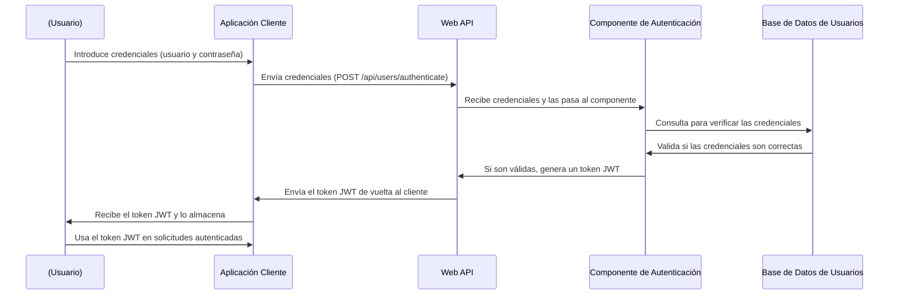

# Api-Nisum
# **Documentación de Prueba Técnica para Api-Nisum**

## Introducción
Esta documentación detalla el desarrollo de un servicio API RESTful para la posición de Senior Developer Backend Java en Nisum. El objetivo principal del proyecto es diseñar y construir un servicio que gestione la administración de usuarios, permitiendo operaciones como el registro, la autenticación y la consulta de datos de los usuarios.

## Descripción del Proyecto
### Arquitectura y Estructura del Proyecto
El proyecto está organizado utilizando una estructura de paquetes por componentes, lo que facilita la modularidad y el mantenimiento del código. Esta organización permite separar claramente la lógica de negocio, la persistencia de datos, y la interfaz de usuario, mejorando la escalabilidad y la gestión del código.

### Tecnologías y Herramientas Utilizadas
* **[Spring Boot:](https://start.spring.io/)** Utilizado para simplificar la configuración inicial del proyecto y la gestión de dependencias.
* **Spring Data JPA**: Facilita la integración con la base de datos H2 y simplifica las operaciones CRUD mediante el uso de interfaces de repositorio.
* **Spring Security**: Proporciona las capacidades de autenticación y autorización, asegurando que solo los usuarios autenticados puedan acceder a ciertas operaciones.
* **Spring Web**: Permite la creación de endpoints REST y maneja las solicitudes HTTP.
* **[H2 Database:](https://www.postgresql.org/)** Base de datos en memoria utilizada para el desarrollo y pruebas, proporcionando persistencia rápida y configuración sencilla.
* **Spring Validation**: Utilizado para asegurar que los datos ingresados por los usuarios cumplan con los criterios especificados antes de ser procesados o almacenados, lo cual es crucial para mantener la integridad de los datos.
* **Spring Web Test**: Proporciona herramientas para realizar pruebas de integración en los componentes web, permitiendo simular y verificar el comportamiento de los endpoints de la API bajo diversas condiciones.
* **[Swagger:](https://springdoc.org/#google_vignette)** Genera la documentación interactiva de la API, facilitando la prueba y visualización de los endpoints disponibles.
* **[jjwt:](https://github.com/jwtk/jjwt)** Utilizado para la generación y validación de tokens JWT, esencial para la gestión de sesiones y autenticación.
* **[Spotless:](https://github.com/diffplug/spotless)** Herramienta de formateo de código que asegura un estilo coherente en todo el proyecto.
* **[Taskfile.dev:](https://taskfile.dev/)** Herramienta de automatización que se emplea para definir y ejecutar tareas de desarrollo, como compilaciones y ejecución de pruebas.

## Patrones de Diseño Implementados
* **Dependency Injection**: Ampliamente utilizado a través de Spring Framework, este patrón facilita la gestión de dependencias y la configuración del proyecto, promoviendo un código más limpio y mantenible.
* **Repository**: Implementado mediante Spring Data JPA para abstraer la lógica de acceso a datos. Esto simplifica las operaciones con la base de datos y mejora la mantenibilidad del código al separar la lógica de negocio de la de persistencia
* **Factory**: Empleado para la creación de objetos complejos. Este patrón permite una mayor flexibilidad y desacoplamiento en la creación de instancias, facilitando la extensión y el mantenimiento del código..
* **Singleton**: Utilizado para garantizar que una clase tenga una única instancia y proporcionar un punto de acceso global a ella. En este proyecto, AuthenticationManagerBuilder se configura como un singleton, asegurando que solo exista una instancia de este componente en la aplicación

## Principios SOLID
* **Principio de Responsabilidad Única (SRP)**: Cada clase se ha diseñado para tener una sola razón para cambiar, lo cual se logra segregando las funcionalidades en distintos servicios y repositorios, minimizando así las dependencias cruzadas.
* **Principio de Inversión de Dependencias (DIP)**: Se ha aplicado este principio para reducir la dependencia de implementaciones concretas y fomentar la dependencia de abstracciones. Esto se observa en cómo las capas superiores de la aplicación interactúan con interfaces en lugar de con implementaciones concretas, lo que facilita la sustitución de componentes y la realización de pruebas.

## Ejecutar Proyecto
Para poner en funcionamiento el proyecto API-Nisum, siga los pasos detallados a continuación. Asegúrese de tener instalado Java en su máquina, así como las herramientas necesarias como Git y Maven o Task, dependiendo del método de ejecución que prefiera.

## Clonar el Repositorio
Inicialmente, deberá obtener una copia del código fuente alojado en GitHub. Abra una terminal en su sistema y ejecute el siguiente comando para clonar el repositorio:

```bash
git clone https://github.com/Geovanny0401/api-nisum.git
```

## Cambiar al Directorio del Proyecto
Una vez clonado el repositorio, cambie al directorio del proyecto ejecutando:
```bash
 cd api-nisum
```

## Opciones para Ejecutar el Proyecto
Puede iniciar el proyecto utilizando Maven o Task. A continuación, se describen ambas opciones:

* **Opción A: Usando Maven**
Maven puede compilar y ejecutar el proyecto utilizando el plugin de Spring Boot. Ejecute el siguiente comando en la terminal:
```bash
   mvn spring-boot:run   
```
Este comando compilará el proyecto si es necesario y luego iniciará la aplicación. Estará accesible desde http://localhost:8081/api/users.

**Opción B: Usando Task**
Si prefiere usar `Taskfile.dev` para la ejecución del proyecto, lo cual puede incluir pasos adicionales configurados como la compilación y pruebas, ejecute el siguiente comando:
```bash
   task run_app   
```
Este comando activará las definiciones especificadas en Taskfile.yml, que pueden incluir no solo la ejecución de la aplicación sino también la ejecución de pruebas y otras tareas preconfiguradas.

## Diseño del Sistema
### Arquitectura "Package by Component"
La arquitectura "Package by Component" es una estrategia de organización de código fuente en la que se agrupan las clases y otros recursos según su funcionalidad específica o componente, en lugar de por capas (como modelo, vista, controlador). En este proyecto, se adoptó este enfoque para mejorar la modularidad y la mantenibilidad del código. A continuación, se describen las ventajas de esta estructura:

## Diagrama de Secuencia 


## Endpoints

### Autenticación de Usuarios
- **Descripción**: Autentica a los usuarios y retorna un token de acceso.
- **Method**: `POST`
- **Path** : `api/users/authenticate`
- **Códigos de Respuesta**:
- - `200`: Autenticación exitosa.
- - `401`: Autenticación fallida.

**Ejemplo de Uso:**

```bash
curl --request POST \
  --url http://localhost:8081/api/users/authenticate \
  --header 'Content-Type: application/json' \
  --data '{
	"email": "geovanny.mendoza@gmail.com",
	"password": "Password123!"
}'
```

### Creación de Usuario
- **Descripción** : Registra un nuevo usuario en el sistema.
- **Método HTTP** : POST
- **Path** : /api/users/
- **Códigos de Respuesta**:
- - `201`: Usuario creado exitosamente.
- - `400`: Error en los datos proporcionados.
- - `409`: El correo de xxx@xx.x ya se encuentra registrado.

**Ejemplo de Uso**
```bash
curl --request POST \
  --url http://localhost:8081/api/users \
  --header 'Authorization: Bearer [YourTokenHere]' \
  --header 'Content-Type: application/json' \
  --data '{
	"name": "Elena Aguirre",
	"email": "elena.aguirre@gmail.com",
	"password": "hunter22",
	"phones": [
		{
			"number": "3001001077",
			"cityCode": "08",
			"countryCode": "20"
		}
	],
	"role": "USER"
}'
```

### Listado de Usuarios
- **Descripción** : Retorna una lista de todos los usuarios registrados en el sistema.
- **Método HTTP** : GET
- **Path** : /api/users
- **Códigos de Respuesta** :
- - `200`: Listado de usuarios obtenido correctamente.
- - `403`: Acceso denegado.
- 
**Ejemplo de Uso**:
```bash
curl --request GET \
  --url http://localhost:8081/api/users \
  --header 'Authorization: Bearer [YourTokenHere]' \
  --header 'Content-Type: application/json' \
```

## Funcionalidades del Servicio
### **Autenticación de Usuarios**
* **Registro de Usuarios**: Permite a nuevos usuarios registrarse, almacenando sus credenciales de forma segura.
* **Login de Usuarios**: Autentica a los usuarios y genera un token JWT para sesiones seguras.
### Administración de Usuarios
* **Consulta de Información**: Los usuarios pueden consultar y actualizar su información personal después de autenticarse.

## Demostración de la API

Esta animación muestra el funcionamiento en vivo de nuestra API, destacando cómo los usuarios pueden registrarse, crear sus perfiles y consultar su información de manera segura y eficiente.


## Pruebas Implementadas
Se desarrollaron pruebas unitarias para validar la funcionalidad y robustez del servicio. Las pruebas unitarias se centraron en componentes individuales.

## Conclusiones y Mejoras Futuras
El proyecto ha demostrado ser una solución efectiva para la gestión de usuarios, sin embargo, se identificaron oportunidades de mejora como la implementación de caché para mejorar el rendimiento y la introducción de más pruebas automatizadas para cubrir escenarios de error.

## Apéndice
**Taskfile.yml**: Ejemplo de definiciones de tareas utilizadas en el proyecto.
